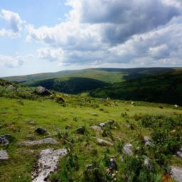
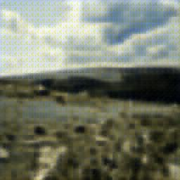
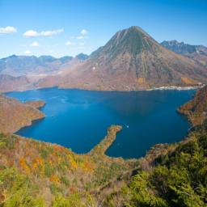
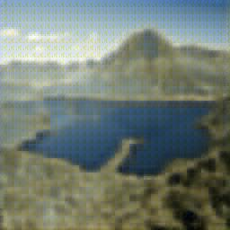
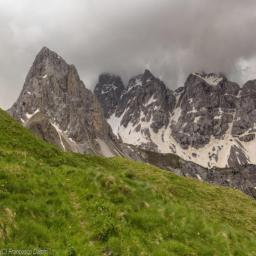
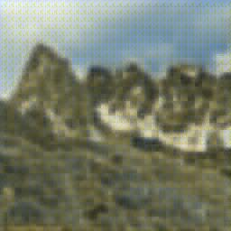
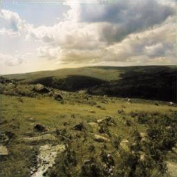
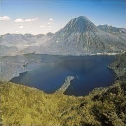
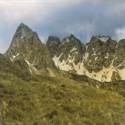

# Image Colorizer

This repository contains code for implementation of various models for **image colorization**

# Dataset

["Landscape Pictures"](https://www.kaggle.com/datasets/arnaud58/landscape-pictures) Dataset was used to train models

# Models

Two models were trained and tested:

- **Autoencoder**

<table>
    <thead>
        <td>Original colored image</td>
        <td>Model prediction</td>
    </thead>
    <tr>
        <td></td>
        <td></td>
    </tr>
    <tr>
        <td></td>
        <td></td>
    </tr>
    <tr>
        <td></td>
        <td></td>
    </tr>
</table>

- **U-NET**
<table>
    <thead>
        <td>Original colored image</td>
        <td>Model prediction</td>
    </thead>
    <tr>
        <td></td>
        <td></td>
    </tr>
    <tr>
        <td></td>
        <td></td>
    </tr>
    <tr>
        <td></td>
        <td></td>
    </tr>
</table>

# How to use

- install all the libraries using *conda* or *pip*
For conda:
```
conda env create -f environment.yaml
```
For pip:
```
pip install -r requirements.txt
```
- train models
For AE:
```
python train.py
```
For U-NET:
```
python train_unet.py
```

Also, you can try out the model by running **Streamlit**:
```
streamlit run ui.py
```